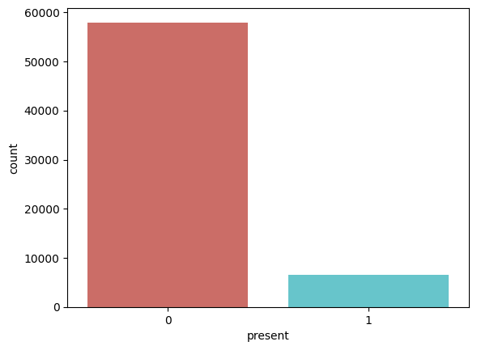
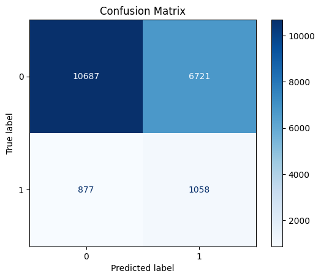
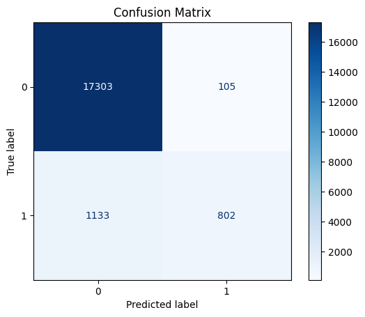
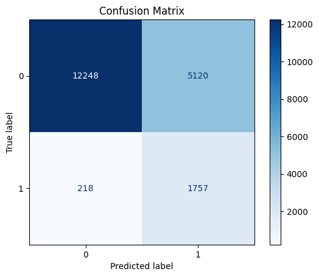
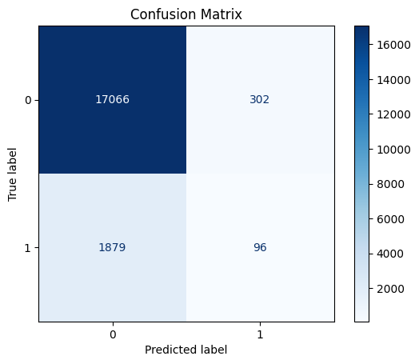
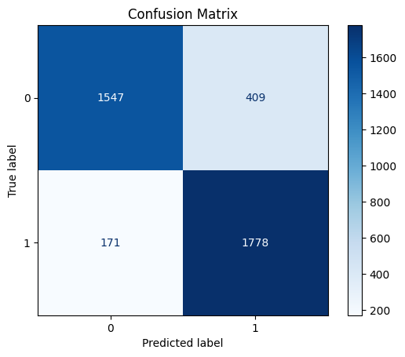
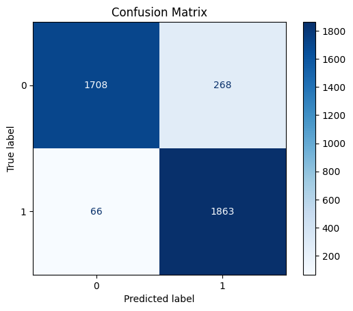
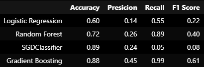

# LumeNN

**LumeNN** — это нейронная сеть, которая решает проблему бинарной и многоклассовой
классификации переменных звёзд.

# Бинарная классификация

## Набор данных

Набор данных получен посредством слияния каталогов [APASS](https://www.aavso.org/apass) 
и [GALEX](https://galex.stsci.edu/GR6/) в [X-Match](http://cdsxmatch.u-strasbg.fr/) и просеивания
через [VSX](https://www.aavso.org/vsx/).
Далее датасет был очищен:
- удалео 512 строк с ошибкой более 1,
- удалена колонка type, ибо она заполнена менее, чем на 10%,
- удалены 4 строки без данных о минимальной и максимальной магнитудах (min_mag, max_mag).

Но в полученных данных ещё есть проблема с разделением на классы:

Мы эту проблему пробовали решать двумя разными способами:

- Взвешивание классов
- Увеличение (Oversampling) и уменьшение (Undersampling) выборки

## Решение с помощью встроенных в scikit-learn моделей

### Логистическая регрессия

Accuracy:  0.6071964017991005 \
Precision:  0.1360071988687492 \
Recall:  0.5467700258397933 \
F1 score:  0.21782993617459337

### Случайный лес - default parameters

Accuracy:  0.9359975184821382\
Precision:  0.8842337375964718\
Recall:  0.4144702842377261\
F1 score:  0.5643912737508796

### Случайный лес - max_deph = 5, random_state=42

Accuracy:  0.7240345344569095\
Precision:  0.25548931220008725\
**Recall:  0.889620253164557**\
F1 score:  0.39697243560777223

Большое значение метрики Recall говорит нам о том, что модель смогла выявить большую
часть переменных звёзд из всех реально переменных. Хотя процент ложных срабатываний
удручает.

### SGDClassifier

loss: modified_huber

Accuracy:  0.8872460321563356\
Precision:  0.24120603015075376\
Recall:  0.04860759493670886\
F1 score:  0.08091024020227561

### Gradient Boosting

Так как у градиентного бустинга в sklearn отсутствует возможность задать веса
классам, к выборке был применен undersampling.

#### default parameters

Accuracy:  0.8162642816522773\
Precision:  0.3515713744793639\
Recall:  0.9350453172205438\
F1 score:  0.5110071546505228

#### max_depth = 10

Accuracy:  0.8786124179289666\
Precision:  0.450624558095687\
Recall:  0.991187143597719\
F1 score:  0.6195722618276086

## Выводы

Видно, что лучше всего по совокупности метрик показал себя градиентный бустинг.