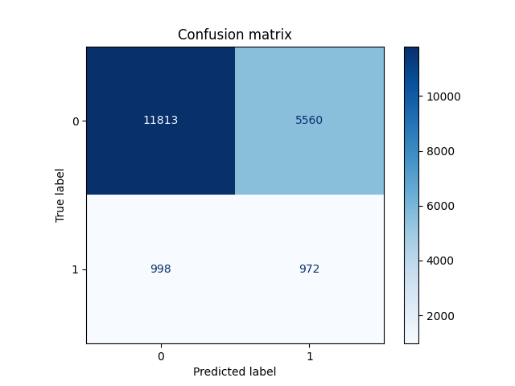

# LumeNN

**LumeNN** — приложение, решающее проблему **бинарной** и **многоклассовой**
классификации звёзд переменной светимости, используя различные модели машинного обучения.

## Бинарная классификация

### Набор данных

Набор данных получен посредством слияния каталогов [APASS](https://www.aavso.org/apass)
и [GALEX](https://galex.stsci.edu/GR6/) в [X-Match](http://cdsxmatch.u-strasbg.fr/)
и просеивания полученного через [VSX](https://www.aavso.org/vsx/).

Далее датасет был очищен:

- удалено 512 строк с ошибкой более 1
- удалена колонка `type`, поскольку она заполнена менее, чем на 10%
- удалены 4 строки без данных о минимальной и максимальной магнитудах (`min_mag`, `max_mag`)

В полученных данных есть проблема с разделением на классы,
эта проблема в ходе исследования решалась **взвешиванием классов** или **уменьшением выборки**.

### Исследование

Решение проблемы бинарной классификации проводилось как с помощью встроенных
в [`scikit-learn`](https://scikit-learn.org/stable/) моделей,
так и с использованием нейронных сетей на основе [`keras`](https://keras.io/)
и [`tensorflow`](https://www.tensorflow.org/).

В ходе исследования использовались метрики `accuracy`, `precision`, `recall`, `F1-score`.
Поскольку целью является определение звезд с переменной светимостью,
а их количество относительно общего объема данных мало,
было принято решение максимизировать именно метрику `recall`.

#### Встроенные модели `scikit-learn`

Ниже представлены классификаторы на основе моделей из библиотеки [`scikit-learn`](https://scikit-learn.org/stable/).

##### Логистическая регрессия; взвешивание классов

| Accuracy | Precision | Recall | F1-score |
|:--------:|:---------:|:------:|:--------:|
|  0.607   |   0.136   | 0.547  |  0.218   |

##### Случайный лес (стандартные параметры); взвешивание классов

| Accuracy | Precision | Recall | F1-score |
|:--------:|:---------:|:------:|:--------:|
|  0.936   |   0.884   | 0.414  |  0.564   |

##### Случайный лес (параметры: `max_depth = 5, random_state=42`); взвешивание классов

| Accuracy | Precision | Recall | F1-score |
|:--------:|:---------:|:------:|:--------:|
|  0.724   |   0.255   | 0.900  |  0.397   |

##### `SGDClassifier` (функция потерь `modified_huber`); взвешивание классов

| Accuracy | Precision | Recall | F1-score |
|:--------:|:---------:|:------:|:--------:|
|  0.887   |   0.241   | 0.048  |  0.081   |

##### Градиентный бустинг (стандартные параметры); уменьшение выборки

| Accuracy | Precision | Recall | F1-score |
|:--------:|:---------:|:------:|:--------:|
|  0.816   |   0.352   | 0.935  |  0.511   |

##### Градиентный бустинг (параметры: `max_depth=10`); уменьшение выборки

| Accuracy | Precision | Recall | F1-score |
|:--------:|:---------:|:------:|:--------:|
|  0.879   |   0.451   | 0.991  |  0.620   |

### Нейронные сети

Ниже представлены классификаторы на основе нейронных сетей;
вместе с каждым также указаны параметры сети и гиперпараметры обучения.

#### Нейронная сеть, эмулирующая логистическую регрессию; взвешивание классов

Конфигурация нейронной сети:

|                     |  Слой 1   |
|:--------------------|:---------:|
| Количество нейронов |     1     |
| Функция активации   | `sigmoid` |

Гиперпараметры обучения:

| Количество эпох | Оптимизатор |                                      Learning rate                                       |                               Функция потерь                                |
|:---------------:|:-----------:|:----------------------------------------------------------------------------------------:|:---------------------------------------------------------------------------:|
|       50        |   `Adam`    | `keras.optimizers.schedules.ExponentialDecay(1e-2, decay_steps=15000, decay_rate=0.01))` | `BinaryFocalCrossentropy(apply_class_balancing=True, alpha=0.9, gamma=1.0)` |

| Accuracy | Precision | Recall | F1-score |
|:--------:|:---------:|:------:|:--------:|
|  0.661   |   0.149   | 0.493  |  0.229   |

### Итоги

Полная таблица результатов исследования представлена ниже.

|                                                   | Accuracy | Precision |  Recall   | F1-score |
|:--------------------------------------------------|:--------:|:---------:|:---------:|:--------:|
| Логистическая регрессия                           |  0.607   |   0.136   |   0.547   |  0.218   |
| Случайный лес (стандартные параметры)             |  0.936   |   0.884   |   0.414   |  0.564   |
| Случайный лес (`max_depth = 5, random_state=42`)  |  0.724   |   0.255   |   0.900   |  0.397   |
| `SGDClassifier` (функция потерь `modified_huber`) |  0.887   |   0.241   |   0.048   |  0.081   |
| Градиентный бустинг (стандартные параметры)       |  0.816   |   0.352   |   0.935   |  0.511   |
| Градиентный бустинг (`max_depth=10`)              |  0.879   |   0.451   | **0.991** |  0.620   |
|                                                   |          |           |           |
| Нейронная сеть (логистическая регрессия)          |  0.661   |   0.149   |   0.493   |  0.229   |

Из всех классификаторов **настроенный градиентный бустинг** показал себя лучше всего по совокупности метрик;
`recall` максимален, при этом `accuracy` находится на достойном уровне.
