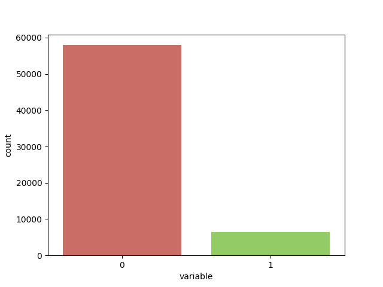
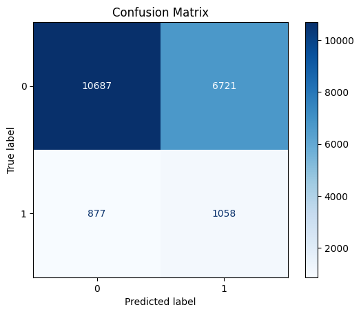
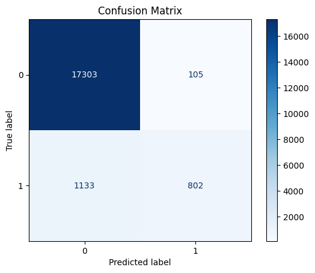
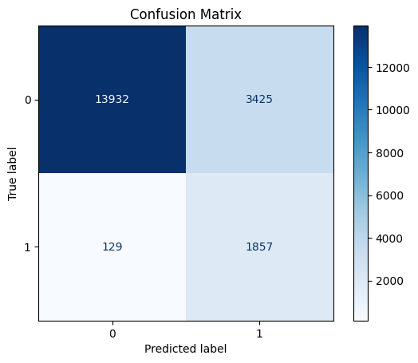
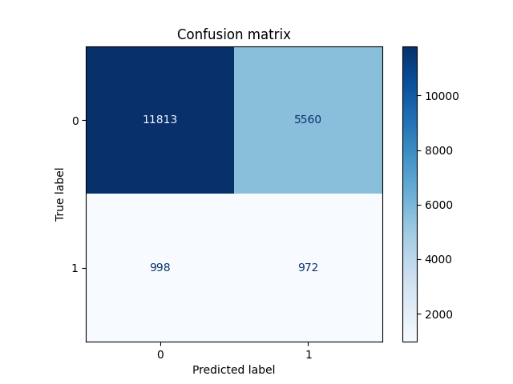
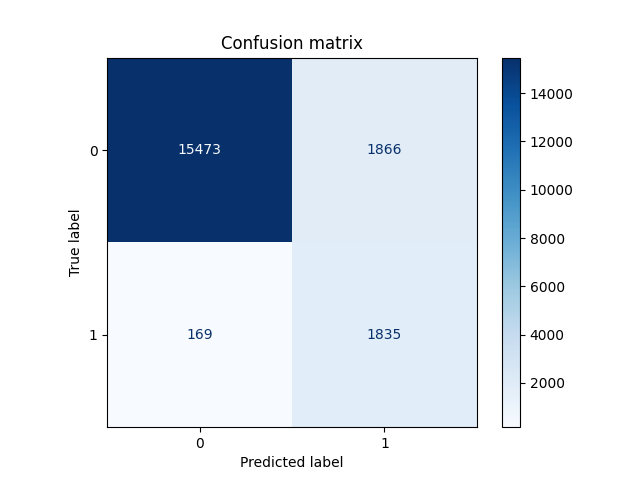

# LumeNN

**LumeNN** — приложение, решающее проблему **бинарной** и **многоклассовой**
классификации звёзд переменной светимости, используя различные модели машинного обучения.

## Актуальность исследования

В связи с тем, что к данному моменту накопилось значительное количество данных космических наблюдений,
которые могут иметь большую ценность для астрономии и астрофизики, необходимо разработать метод,
позволяющий эффективно и точно идентифицировать звезды переменной светимости среди этих небесных тел.
Данная разработка может помочь ученым не проверять вручную все эти наблюдения,
а сфокусировать свое внимание только на отобранных.

## Бинарная классификация

### Набор данных

Набор данных получен посредством слияния каталогов [APASS](https://www.aavso.org/apass)
и [GALEX](https://galex.stsci.edu/GR6/) в [X-Match](http://cdsxmatch.u-strasbg.fr/)
и просеивания полученного через [VSX](https://www.aavso.org/vsx/).

#### Обработка данных

Для обработки данных необходимо принять во внимание значение характеристик
небесных тел из нашего набора данных:

- `RAJ2000` — прямое восхождение звезды в эпохе J2000 (в градусах)
- `DEJ2000` — склонение звезды в эпохе J2000 (в градусах)
- `nobs` — количество наблюдений звезды
- `Vmag` — видимая звёздная величина в V-фильтре (оптический диапазон)
- `e_Vmag` — ошибка измерения `Vmag`
- `Bmag` — видимая звёздная величина в B-фильтре (синий диапазон)
- `e_Bmag` — ошибка измерения `Bmag`
- `gpmag` — видимая звёздная величина в фильтре Gaia G (данные от космического телескопа Gaia)
- `e_gpmag` — ошибка измерения `gpmag`
- `rpmag` — видимая звёздная величина в фильтре Gaia RP (красный диапазон, данные Gaia)
- `e_rpmag` — ошибка измерения `rpmag`
- `ipmag` — видимая звёздная величина в I-фильтре (ближний инфракрасный диапазон)
- `e_ipmag` — ошибка измерения `ipmag`
- `fuv_mag` — видимая звёздная величина в ультрафиолетовом диапазоне
- `mvv_mag` — видимая звёздная величина в визуальном диапазоне
- `err` — обобщённая ошибка измерений
- `present` — флаг переменности звезды (0 — не является переменной, 1 — является)
- `type` — тип переменности звезды
- `min_mag` — минимальная видимая звёздная величина звезды в течение её переменного цикла
- `max_mag` — максимальная видимая звёздная величина звезды в течение её переменного цикла

Колонки `present` и `type` нужны для бинарной и многоклассовой классификации -
на этом этапе колонка `type` использоваться не будет.

Рассмотрим корреляцию характеристик с переменностью звезды:

|           | variable  |
|:---------:|:---------:|
| `RAJ2000` | -0.007308 |
| `DEJ2000` | -0.012249 |
|  `nobs`   | -0.002505 |
|  `Vmag`   | 0.029900  |
| `e_Vmag`  | 0.133351  |
|  `Bmag`   | 0.028588  |
| `e_Bmag`  | 0.111372  |
|  `gpmag`  | 0.029341  |
| `e_gpmag` | 0.077565  |
|  `rpmag`  | 0.029131  |
| `e_rpmag` | 0.102294  |
|  `ipmag`  | 0.026696  |
| `e_ipmag` | 0.031454  |
| `fuv_mag` | -0.069927 |
| `nuv_mag` | 0.041075  |
| `min_mag` | 0.012656  |
| `max_mag` | -0.014640 |
|   `err`   | 0.091020  |

Из таблицы видно, что наибольшее влияние оказывают колонки, связанные с ошибкой.
Наше объяснение таково: переменность светимости непосредственно связана
с изменением видимой звездной величины, а её изменение регистрируется как ошибка.
Ошибка в данном случае представляет собой среднеквадратичное отклонение наблюдаемой величины от матожидания,
и чем она больше, тем, вероятно, сильнее изменяется эта характеристика (и тем меньше влияние ошибок измерения).

Спорным моментом является трактование влияния колонок `RAJ2000` и `DEJ2000` - они представляют координаты звезды,
и, хотя кажется, что они не должны влиять на переменность светимости, корреляция указывает обратное
(наше исследование показало, что модели обучающиеся на полных данных показывают себя чуть лучше).

В полученных данных есть проблема с разделением на классы:

Эта проблема в ходе исследования решалась **взвешиванием классов** или **уменьшением выборки**.

### Исследование

Решение проблемы бинарной классификации проводилось как с помощью встроенных
в [`scikit-learn`](https://scikit-learn.org/stable/) моделей,
так и с использованием нейронных сетей на основе [`keras`](https://keras.io/)
и [`tensorflow`](https://www.tensorflow.org/).

В ходе исследования использовались метрики `accuracy`, `precision`, `recall`, `F1-score`.
Целью является определение звезд с переменной светимостью,
а их количество относительно общего объема данных мало.
С одной стороны, нежелательно пропускать звезду с переменной светимостью (максимизация `recall`),
с другой же, слишком большое количество ошибок нежелательно для перепроверяющего (максимизация `F1-score`).
Далее мы фокусировались на максимизации `recall` и `F1-score`.

#### Встроенные модели `scikit-learn`

Ниже представлены классификаторы на основе моделей из библиотеки [`scikit-learn`](https://scikit-learn.org/stable/).

##### Логистическая регрессия; взвешивание классов

| Accuracy | Precision | Recall | F1-score |
|:--------:|:---------:|:------:|:--------:|
|  0.607   |   0.136   | 0.547  |  0.218   |

##### Случайный лес (стандартные параметры); взвешивание классов

| Accuracy | Precision | Recall | F1-score |
|:--------:|:---------:|:------:|:--------:|
|  0.936   |   0.884   | 0.414  |  0.564   |

##### Случайный лес (параметры: `max_depth = 5, random_state=42`); взвешивание классов

| Accuracy | Precision | Recall | F1-score |
|:--------:|:---------:|:------:|:--------:|
|  0.724   |   0.255   | 0.900  |  0.397   |

##### `SGDClassifier` (функция потерь `modified_huber`); взвешивание классов

| Accuracy | Precision | Recall | F1-score |
|:--------:|:---------:|:------:|:--------:|
|  0.887   |   0.241   | 0.048  |  0.081   |

##### Градиентный бустинг (стандартные параметры); уменьшение выборки

| Accuracy | Precision | Recall | F1-score |
|:--------:|:---------:|:------:|:--------:|
|  0.816   |   0.352   | 0.935  |  0.511   |

##### Градиентный бустинг (параметры: `max_depth=10`); уменьшение выборки

| Accuracy | Precision | Recall | F1-score |
|:--------:|:---------:|:------:|:--------:|
|  0.879   |   0.451   | 0.991  |  0.620   |

#### Нейронные сети

Ниже представлены классификаторы на основе нейронных сетей;
вместе с каждым также указаны параметры сети и гиперпараметры обучения.

##### Нейронная сеть, эмулирующая логистическую регрессию; взвешивание классов

Конфигурация нейронной сети:

|                     |  Слой 1   |
|:--------------------|:---------:|
| Количество нейронов |     1     |
| Функция активации   | `sigmoid` |

Гиперпараметры обучения:

| Количество эпох | Оптимизатор |                                      Learning rate                                       |                               Функция потерь                                |
|:---------------:|:-----------:|:----------------------------------------------------------------------------------------:|:---------------------------------------------------------------------------:|
|       50        |   `Adam`    | `keras.optimizers.schedules.ExponentialDecay(1e-2, decay_steps=15000, decay_rate=0.01))` | `BinaryFocalCrossentropy(apply_class_balancing=True, alpha=0.9, gamma=1.0)` |

| Accuracy | Precision | Recall | F1-score |
|:--------:|:---------:|:------:|:--------:|
|  0.661   |   0.149   | 0.493  |  0.229   |

##### Лучший классификатор

Конфигурация нейронной сети:

|                     | Слой 1 |    Слой 2     |  Слой 3   |
|:--------------------|:------:|:-------------:|:---------:|
| Количество нейронов |  1024  |      128      |     1     |
| Функция активации   | `mish` | `hard_shrink` | `sigmoid` |

Гиперпараметры обучения:

| Количество эпох | Оптимизатор |                                      Learning rate                                       |                               Функция потерь                                |
|:---------------:|:-----------:|:----------------------------------------------------------------------------------------:|:---------------------------------------------------------------------------:|
|       24        |   `Adam`    | `keras.optimizers.schedules.ExponentialDecay(1e-2, decay_steps=15000, decay_rate=0.01))` | `BinaryFocalCrossentropy(apply_class_balancing=True, alpha=0.9, gamma=1.0)` |

| Accuracy | Precision | Recall | F1-score |
|:--------:|:---------:|:------:|:--------:|
|  0.895   |   0.496   | 0.916  |  0.643   |

###### Замечание

В ходе исследования мы выявили проблему сходимости по гиперплоскости ошибки.
Начальные условия (обычно задающиеся случайно) очень сильно влияют на результаты моделей - 
они колеблятся между отсутствием предсказания как такового (всегда 0 или всегда 1)
и лучшим предсказанием среди всех моделей.
[Веса](datasets/best_weights.keras) этой модели, отражающие успешную тренировку на первых 8 эпохах,
сохранены в отдельном файле, с которого происходит загрузка при запуске программы.

### Итоги

Полная таблица результатов исследования представлена ниже.

|                                                   | Accuracy | Precision |  Recall   | F1-score  |
|:--------------------------------------------------|:--------:|:---------:|:---------:|:---------:|
| Логистическая регрессия                           |  0.607   |   0.136   |   0.547   |   0.218   |
| Случайный лес (стандартные параметры)             |  0.936   |   0.884   |   0.414   |   0.564   |
| Случайный лес (`max_depth = 5, random_state=42`)  |  0.724   |   0.255   |   0.900   |   0.397   |
| `SGDClassifier` (функция потерь `modified_huber`) |  0.887   |   0.241   |   0.048   |   0.081   |
| Градиентный бустинг (стандартные параметры)       |  0.816   |   0.352   |   0.935   |   0.511   |
| Градиентный бустинг (`max_depth=10`)              |  0.879   |   0.451   | **0.991** |   0.620   |
|                                                   |          |           |           |           |
| Нейронная сеть (логистическая регрессия)          |  0.661   |   0.149   |   0.493   |   0.229   |
| Нейронная сеть                                    |  0.895   | **0.496** |   0.916   | **0.643** |

Из всех классификаторов `scikit-learn` **настроенный градиентный бустинг** показал себя лучше всего по совокупности
метрик;
`recall` максимален, при этом `F1-score` находится на достойном уровне.

Полученная нейронная сеть, хоть и показывает меньший `recall`, имеет больший `precision` и `F1-score`,
и, по нашему мнению, является лучшим классификатором.
