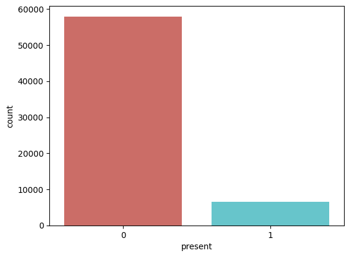
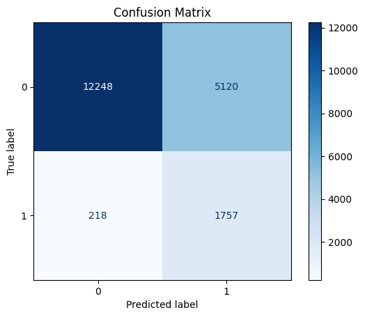
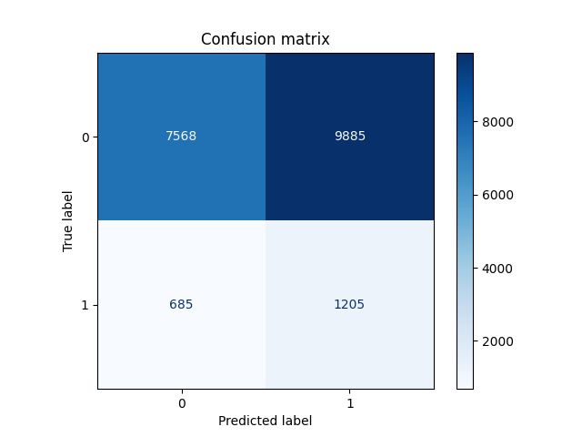

# LumeNN

**LumeNN** — приложение, решающее проблему **бинарной** и **многоклассовой**
классификации звёзд переменной светимости, используя различные модели машинного обучения.

## Бинарная классификация

### Набор данных

Набор данных получен посредством слияния каталогов [APASS](https://www.aavso.org/apass) 
и [GALEX](https://galex.stsci.edu/GR6/) в [X-Match](http://cdsxmatch.u-strasbg.fr/)
и просеивания полученного через [VSX](https://www.aavso.org/vsx/).

Далее датасет был очищен:
- удалено 512 строк с ошибкой более 1
- удалена колонка `type`, поскольку она заполнена менее, чем на 10%
- удалены 4 строки без данных о минимальной и максимальной магнитудах (`min_mag`, `max_mag`)

В полученных данных есть проблема с разделением на классы,
эта проблема в ходе исследования решалась **взвешиванием классов** или **уменьшением выборки**.

### Исследование

Решение проблемы бинарной классификации проводилось как с помощью встроенных в [`sklearn`](https://scikit-learn.org/stable/) моделей,
так и с использованием нейронных сетей на основе [`keras`](https://keras.io/) и [`tensorflow`](https://www.tensorflow.org/).

В ходе исследования использовались метрики `accuracy`, `precision`, `recall`, `F1-score`.
Поскольку целью является определение звезд с переменной светимостью,
а их количество относительно общего объема данных мало,
было принято решение максимизировать именно метрику `recall`.

Ниже представлены матрицы ошибок и значения метрик для каждого из классификаторов.

#### Логистическая регрессия; взвешивание классов

| Accuracy | Precision | Recall | F1-score |
|:--------:|:---------:|:------:|:--------:|
|  0.607   |   0.136   | 0.547  |  0.218   |

#### Случайный лес (стандартные параметры); взвешивание классов

| Accuracy | Precision | Recall | F1-score |
|:--------:|:---------:|:------:|:--------:|
|  0.936   |   0.884   | 0.414  |  0.564   |

#### Случайный лес (параметры: `max_depth = 5, random_state=42`); взвешивание классов

| Accuracy | Precision | Recall | F1-score |
|:--------:|:---------:|:------:|:--------:|
|  0.724   |   0.255   | 0.900  |  0.397   |

#### `SGDClassifier` (функция потерь `modified_huber`); взвешивание классов

| Accuracy | Precision | Recall | F1-score |
|:--------:|:---------:|:------:|:--------:|
|  0.887   |   0.241   | 0.048  |  0.081   |

#### Градиентный бустинг (стандартные параметры); уменьшение выборки

| Accuracy | Precision | Recall | F1-score |
|:--------:|:---------:|:------:|:--------:|
|  0.816   |   0.352   | 0.935  |  0.511   |

#### Градиентный бустинг (параметры: `max_depth=10`); уменьшение выборки

| Accuracy | Precision | Recall | F1-score |
|:--------:|:---------:|:------:|:--------:|
|  0.879   |   0.451   | 0.991  |  0.620   |

#### Полносвязная нейронная сеть (функция потерь: `BinaryFocalCrossentropy`); уменьшение выборки 

Конфигурация нейронной сети

|                     |    Слой 1    |    Слой 2    |  Слой 3   |
|---------------------|:------------:|:------------:|:---------:|
| Количество нейронов |     512      |     512      |     1     |
| Функция активации   | `leaky_relu` | `leaky_relu` | `sigmoid` |

| Accuracy | Precision | Recall | F1-score |
|:--------:|:---------:|:------:|:--------:|
|  0.476   |   0.111   | 0.583  |  0.187   |

### Итоги

Полная таблица результатов исследования представлена ниже.

|                                                   | Accuracy | Precision |  Recall   | F1-score |
|:--------------------------------------------------|:--------:|:---------:|:---------:|:--------:|
| Логистическая регрессия                           |  0.607   |   0.136   |   0.547   |  0.218   |
| Случайный лес (стандартные параметры)             |  0.936   |   0.884   |   0.414   |  0.564   |
| Случайный лес (`max_depth = 5, random_state=42`)  |  0.724   |   0.255   |   0.900   |  0.397   |
| `SGDClassifier` (функция потерь `modified_huber`) |  0.887   |   0.241   |   0.048   |  0.081   |
| Градиентный бустинг (стандартные параметры)       |  0.816   |   0.352   |   0.935   |  0.511   |
| Градиентный бустинг (`max_depth=10`)              |  0.879   |   0.451   | **0.991** |  0.620   |
| Полносвязная нейронная сеть                       |  0.476   |   0.111   |   0.583   |  0.187   |

Из всех классификаторов **настроенный градиентный бустинг** показал себя лучше всего по совокупности метрик;
`recall` максимален, при этом `accuracy` находится на достойном уровне.
