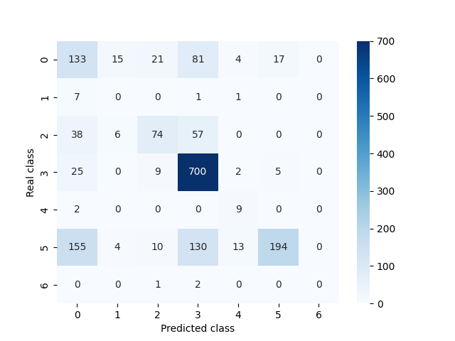

# 🌟**LumeNN**🌟

**LumeNN** is an application that addresses the problem of **binary** and **multiclass** classification
of variable stars using various machine learning models.

## Relevance of the Study

Given the significant accumulation of astronomical observation data,
which holds great value for astronomy and astrophysics,
there is a need to develop a method for efficiently and accurately identifying variable stars
among these celestial objects.
This tool can help scientists avoid manually verifying all observations and
instead focus only on the selected candidates.

## Dataset

The dataset was obtained by merging catalogs from [APASS](https://www.aavso.org/apass)
and [GALEX](https://galex.stsci.edu/GR6/)
using [X-Match](http://cdsxmatch.u-strasbg.fr/)
and filtering the results with [VSX](https://www.aavso.org/vsx/).

## Binary Classification

### Data Processing

When processing the data, the following features of celestial objects must be considered:

- `RAJ2000` — Right Ascension in the J2000 epoch (in degrees)
- `DEJ2000` — Declination in the J2000 epoch (in degrees)
- `nobs` — Number of observations
- `Vmag` — Apparent magnitude in the V-band (optical range)
- `e_Vmag` — Measurement error of `Vmag`
- `Bmag` — Apparent magnitude in the B-band (blue range)
- `e_Bmag` — Measurement error of `Bmag`
- `gpmag` — Apparent magnitude in the Gaia G-band (data from the Gaia space telescope)
- `e_gpmag` — Measurement error of `gpmag`
- `rpmag` — Apparent magnitude in the Gaia RP-band (red range, Gaia data)
- `e_rpmag` — Measurement error of `rpmag`
- `ipmag` — Apparent magnitude in the I-band (near-infrared range)
- `e_ipmag` — Measurement error of `ipmag`
- `fuv_mag` — Apparent magnitude in the far-ultraviolet range
- `nuv_mag` — Apparent magnitude in the near-ultraviolet range
- `err` — Generalized measurement error
- `present` — Variability flag (0 = non-variable, 1 = variable)
- `type` — Type of variability
- `min_mag` — Minimum apparent magnitude during the variability cycle
- `max_mag` — Maximum apparent magnitude during the variability cycle

The columns `present` and `type` are used for binary and multiclass classification, respectively.
At this stage, the `type` column is not utilized.

### Correlation Analysis

The correlation between features and stellar variability is as follows:

|           | variable  |  
|:---------:|:---------:|  
| `RAJ2000` | -0.007308 |  
| `DEJ2000` | -0.012249 |  
|  `nobs`   | -0.002505 |  
|  `Vmag`   | 0.029900  |  
| `e_Vmag`  | 0.133351  |  
|  `Bmag`   | 0.028588  |  
| `e_Bmag`  | 0.111372  |  
|  `gpmag`  | 0.029341  |  
| `e_gpmag` | 0.077565  |  
|  `rpmag`  | 0.029131  |  
| `e_rpmag` | 0.102294  |  
|  `ipmag`  | 0.026696  |  
| `e_ipmag` | 0.031454  |  
| `fuv_mag` | -0.069927 |  
| `nuv_mag` | 0.041075  |  
| `min_mag` | 0.012656  |  
| `max_mag` | -0.014640 |  
|   `err`   | 0.091020  |  

The table shows that error-related columns have the strongest influence.
Our interpretation is that variability is directly linked to changes in apparent magnitude,
which are recorded as measurement errors.
Here, the error represents the standard deviation from the expected value,
and larger errors likely indicate stronger variability (with less influence from measurement inaccuracies).

The influence of `RAJ2000` and `DEJ2000` (stellar coordinates) is debatable —
while they theoretically should not affect variability,
the correlation suggests otherwise (our research indicates models trained on full data perform slightly better).

### Class Imbalance

The dataset suffers from class imbalance:

This issue was addressed during the study using **class weighting** and **undersampling**.

### Research

The binary classification problem was tackled using both built-in [`scikit-learn`](https://scikit-learn.org/stable/)
models
and neural networks based on [`keras`](https://keras.io/) and [`tensorflow`](https://www.tensorflow.org/).

The evaluation metrics included **accuracy**, **precision**, **recall**, and **F1-score**.
The goal was to identify variable stars, which are rare in the dataset.
While maximizing **recall** (avoiding missed detections) was important,
maintaining a reasonable **F1-score** (balancing precision and recall) was also prioritized.

#### Built-in `scikit-learn` Models

##### Logistic Regression (Class Weighting)

| Accuracy | Precision | Recall | F1-score |  
|:--------:|:---------:|:------:|:--------:|  
|  0.607   |   0.136   | 0.547  |  0.218   |

##### Random Forest (`max_depth=11`; Class Weighting)

| Accuracy | Precision | Recall | F1-score |  
|:--------:|:---------:|:------:|:--------:|  
|  0.886   |   0.465   | 0.868  |  0.606   |  

##### SGD (`modified_huber` Loss; Class Weighting)

| Accuracy | Precision | Recall | F1-score |  
|:--------:|:---------:|:------:|:--------:|  
|  0.887   |   0.241   | 0.048  |  0.081   |

##### Gradient Boosting (`max_depth=13`; Undersampling)

| Accuracy | Precision | Recall | F1-score |  
|:--------:|:---------:|:------:|:--------:|  
|  0.879   |   0.451   | 0.991  |  0.620   |  

##### Stacking

| Accuracy | Precision | Recall | F1-score |  
|:--------:|:---------:|:------:|:--------:|  
|  0.949   |   0.831   | 0.620  |  0.710   |  

It works well but fitting takes extremely long time.

#### Neural Networks

##### Neural Network Emulating Logistic Regression (Class Weighting)

**Architecture:**

|  Layer 1  |  
|:---------:|  
| 1 neuron  |  
| `sigmoid` |  

**Hyperparameters:**

| Epochs | Optimizer |  Learning Rate Schedule (`ExponentialDecay`)   | Loss (`BinaryFocalCrossentropy`) |  
|:------:|:---------:|:----------------------------------------------:|:--------------------------------:|  
|   50   |   Adam    | `1e-2`, `decay_steps=15000`, `decay_rate=0.01` |     `alpha=0.9`, `gamma=1.0`     |  

| Accuracy | Precision | Recall | F1-score |  
|:--------:|:---------:|:------:|:--------:|  
|  0.661   |   0.149   | 0.493  |  0.229   |

##### Best Neural Network Classifier (Class Weighting)

**Architecture:**

|   Layer 1    |    Layer 2    |  Layer 3  |  
|:------------:|:-------------:|:---------:|  
| 1024 neurons |  128 neurons  | 1 neuron  |  
|    `mish`    | `hard_shrink` | `sigmoid` |  

**Hyperparameters:**

| Epochs | Optimizer |  Learning Rate Schedule (`ExponentialDecay`)   | Loss (`BinaryFocalCrossentropy`) |  
|:------:|:---------:|:----------------------------------------------:|:--------------------------------:|  
|   24   |   Adam    | `1e-2`, `decay_steps=15000`, `decay_rate=0.01` |     `alpha=0.9`, `gamma=1.0`     |  

| Accuracy | Precision | Recall | F1-score |  
|:--------:|:---------:|:------:|:--------:|  
|  0.895   |   0.496   | 0.916  |  0.643   |  

###### Note

During training, we observed convergence issues due to initial weight sensitivity.
The model’s performance varied significantly based on initialization,
ranging from trivial predictions (all 0 or all 1) to the best performance.
The [weights](datasets/best_weights.keras) from a successful training run (first 8 epochs) were saved
and are loaded when running the application.

### Results

The full comparison of models is summarized below:

| Model                                | Accuracy | Precision |  Recall   | F1-score  |  
|:-------------------------------------|:--------:|:---------:|:---------:|:---------:|  
| Logistic Regression                  |  0.607   |   0.136   |   0.547   |   0.218   |  
| Random Forest (`max_depth=11`)       |  0.886   |   0.465   |   0.868   |   0.606   |  
| SGD (`modified_huber`)               |  0.887   |   0.241   |   0.048   |   0.081   |  
| Gradient Boosting (`max_depth=13`)   |  0.879   |   0.451   | **0.991** |   0.620   |
| Stacking                             |  0.949   | **0.831** |   0.620   | **0.710** |  
|                                      |          |           |           |           |
| Neural Network (Logistic Regression) |  0.661   |   0.149   |   0.493   |   0.229   |  
| **Neural Network**                   |  0.895   |   0.496   |   0.916   |   0.643   |  

Among the `scikit-learn` models, the **Stacking Classifier** performed best overall,
achieving the highest **precision** and **F1-score**. But **Gradient Boosting Classifier**
has the best **recall** that is important in our task.

The neural network might not have the best metrics but their combination looks pretty good
and competetive so this solution has great future.

## Multiclass Classification

### Data

The data is just the same as it was, but now we are using `type` column.

After some grouping here are types of variable stars with their ids:

- `UNKNOWN` - stars with variability that cannot be confidently classified into known categories or with no variability
  at all
- `ECLIPSING` - binary star systems where one star periodically passes in front of the other, causing detectable dips in
  brightness
- `CEPHEIDS` - pulsating variable stars with a precise period-luminosity relationship, used as "standard candles" in
  astronomy
- `RR_LYRAE` - short-period pulsating stars found in globular clusters, with periods < 1 day and lower luminosity
  than `Cepheids`
- `DELTA_SCUTI_ETC` - delta Scuti stars and similar pulsating variables with short periods (hours) and small amplitude
  changes
- `LONG_PERIOD` - stars with variability cycles spanning months to years
- `ROTATIONAL` - variability caused by starspots or non-uniform surface brightness due to rapid rotation
- `ERUPTIVE` - irregular brightness changes due to flares or mass ejections
- `CATACLYSMIC` - cataclysmic variables with sudden outbursts, often in binary systems
- `EMISSION_WR` - Wolf-Rayet stars with strong emission lines from stellar winds

`UNKNOWN` category was removed because now we are trying to classify only types of actual variable stars,
`ERUPTIVE` and `EMISSION_WR` were removed because there are no data available for them in the dataset.

Here is correlation matrix for multiclass dataset:

#### Class Imbalance

Once again there is class imbalance:

Although `CEPHEIDS` and `CATACLYSMIC` stars are almost non-existent in dataset,
it would be a nice challenge to try to classify those correctly.

All models are using balanced class weights, no undersampling is applied
(there would be no data left after undersampling).

### Research

The multiclass classification was solved by built-in [`scikit-learn`](https://scikit-learn.org/stable/) models
which use 1v1 strategy automatically for multiclass.

The models were evaluated using **precision**, **recall**, and **F1-score** for each class,
along with **macro** and **weighted** averages.

#### Logistic Regression

|       Class       | Precision | Recall | F1-Score | Support |  
|:-----------------:|:---------:|:------:|:--------:|:-------:|  
|    `ECLIPSING`    |   0.53    |  0.25  |   0.34   |   280   |  
|    `CEPHEIDS`     |   0.01    |  0.33  |   0.01   |    3    |  
|    `RR_LYRAE`     |   0.46    |  0.54  |   0.50   |   125   |  
| `DELTA_SCUTI_ETC` |   0.76    |  0.83  |   0.80   |   761   |  
|   `LONG_PERIOD`   |   0.12    |  0.47  |   0.20   |   17    |  
|   `ROTATIONAL`    |   0.85    |  0.40  |   0.54   |   528   |  
|   `CATACLYSMIC`   |   0.02    |  1.00  |   0.03   |    2    |  
|                   |   0.72    |  0.58  |   0.61   |  1716   |  

#### SVC

|       Class       | Precision | Recall | F1-Score | Support |  
|:-----------------:|:---------:|:------:|:--------:|:-------:|  
|    `ECLIPSING`    |   0.52    |  0.19  |   0.27   |   262   |  
|    `CEPHEIDS`     |   0.02    |  0.80  |   0.04   |    5    |  
|    `RR_LYRAE`     |   0.35    |  0.27  |   0.31   |   124   |  
| `DELTA_SCUTI_ETC` |   0.65    |  0.50  |   0.57   |   786   |  
|   `LONG_PERIOD`   |   0.06    |  0.58  |   0.10   |   12    |  
|   `ROTATIONAL`    |   0.41    |  0.22  |   0.29   |   524   |  
|   `CATACLYSMIC`   |   0.00    |  0.33  |   0.01   |    3    |  
|                   |   0.53    |  0.35  |   0.41   |  1716   |

#### K-Nearest Neighbors

|       Class       | Precision | Recall | F1-Score | Support |  
|:-----------------:|:---------:|:------:|:--------:|:-------:|  
|    `ECLIPSING`    |   0.40    |  0.43  |   0.41   |   268   |  
|    `CEPHEIDS`     |   0.00    |  0.00  |   0.00   |    4    |  
|    `RR_LYRAE`     |   0.52    |  0.31  |   0.39   |   162   |  
| `DELTA_SCUTI_ETC` |   0.66    |  0.89  |   0.76   |   742   |  
|   `LONG_PERIOD`   |   0.00    |  0.00  |   0.00   |   13    |  
|   `ROTATIONAL`    |   0.69    |  0.44  |   0.54   |   526   |  
|   `CATACLYSMIC`   |   0.00    |  0.00  |   0.00   |    1    |  
|                   |   0.61    |  0.62  |   0.59   |  1716   |

#### Random Forest

|       Class       | Precision | Recall | F1-Score | Support |  
|:-----------------:|:---------:|:------:|:--------:|:-------:|  
|    `ECLIPSING`    |   0.74    |  0.61  |   0.67   |   268   |  
|    `CEPHEIDS`     |   0.50    |  0.25  |   0.33   |    4    |  
|    `RR_LYRAE`     |   0.77    |  0.81  |   0.79   |   140   |  
| `DELTA_SCUTI_ETC` |   0.88    |  0.94  |   0.91   |   760   |  
|   `LONG_PERIOD`   |   0.83    |  0.50  |   0.62   |   10    |  
|   `ROTATIONAL`    |   0.89    |  0.88  |   0.89   |   530   |  
|   `CATACLYSMIC`   |   1.00    |  0.25  |   0.40   |    4    |  
|                   |   0.85    |  0.85  |   0.85   |  1716   |

#### SGD

|       Class       | Precision | Recall | F1-Score | Support |  
|:-----------------:|:---------:|:------:|:--------:|:-------:|  
|    `ECLIPSING`    |   0.37    |  0.49  |   0.42   |   271   |  
|    `CEPHEIDS`     |   0.00    |  0.00  |   0.00   |    9    |  
|    `RR_LYRAE`     |   0.64    |  0.42  |   0.51   |   175   |  
| `DELTA_SCUTI_ETC` |   0.72    |  0.94  |   0.82   |   741   |  
|   `LONG_PERIOD`   |   0.31    |  0.82  |   0.45   |   11    |  
|   `ROTATIONAL`    |   0.90    |  0.38  |   0.54   |   506   |  
|   `CATACLYSMIC`   |   0.00    |  0.00  |   0.00   |    3    |  
|                   |   0.70    |  0.65  |   0.63   |  1716   |

#### Gradient Boosting

|       Class       | Precision | Recall | F1-Score | Support |  
|:-----------------:|:---------:|:------:|:--------:|:-------:|  
|    `ECLIPSING`    |   0.76    |  0.66  |   0.70   |   261   |  
|    `CEPHEIDS`     |   0.11    |  0.12  |   0.12   |    8    |  
|    `RR_LYRAE`     |   0.77    |  0.74  |   0.76   |   133   |  
| `DELTA_SCUTI_ETC` |   0.89    |  0.94  |   0.91   |   766   |  
|   `LONG_PERIOD`   |   0.75    |  0.64  |   0.69   |   14    |  
|   `ROTATIONAL`    |   0.89    |  0.88  |   0.89   |   532   |  
|   `CATACLYSMIC`   |   0.33    |  0.50  |   0.40   |    2    |  
|                   |   0.85    |  0.86  |   0.86   |  1716   |

### Results

The full comparison of models is summarized below:

| Model               | Weighted Precision | Weighted F1-Score |
|---------------------|--------------------|-------------------|
| Logistic Regression | 0.72               | 0.61              |
| SVC                 | 0.53               | 0.41              |
| K-Nearest Neighbors | 0.61               | 0.59              |
| Random Forest       | **0.85**           | **0.85**          |
| SGD                 | 0.70               | 0.63              |
| Gradient Boosting   | **0.85**           | **0.86**          |

Research showed that **Gradient Boosting** and **Random Forest** perform identically good.
Noting that `sklearn` Gradient Boosting can't apply class balancing, that makes it the best classifier
for multiclass classification.

We can also pinpoint how well Gradient Boosting and Random Forest classify `CEPHEIDS` and `CATACLYSMIC` stars:
they are able to recognise those stars even when their amount is very small.

## Conclusion  

This research successfully addressed the challenge of classifying variable stars
through both **binary** (variable/non-variable) and
**multiclass** (variable type) approaches.

The key findings demonstrate that:  

1. **Binary Classification**:  
   - The custom **neural network** (Mish/Hard Shrink activation, Focal Loss) outperformed traditional
   models with an `F1-score` of 0.643, balancing `precision` (0.496) and `recall` (0.916)
   - **Gradient Boosting** achieved the highest `recall` (0.991), making it suitable for minimal false negatives

2. **Multiclass Classification**:  
   - **Gradient Boosting** emerged as the best model, achieving weighted `F1-score` = 0.86 and `precision` = 0.85,
   excelling in identifying common classes (e.g., Delta Scuti) while handling rarer types.
   - Class imbalance significantly impacted rare categories (e.g., Cepheids, Cataclysmic), highlighting the need for targeted data collection or augmentation

3. **Astronomical Insights**:  
   - Error metrics were critical predictors of variability, correlating with physical changes in stellar brightness
   - The neural network’s sensitivity to initial weights suggests astrophysical variability patterns may require careful model initialization

This work provides a robust framework for automating variable star identification,
enabling astronomers to focus on high-value targets and accelerate discoveries in stellar astrophysics.
That, along with interactive component, makes it a great tool for any stellar research.

## Contributions
Feel free to star this repository if you liked our research or if you are interested in it;
in case of latter you are also welcome to contact our with your suggestions or questions.
